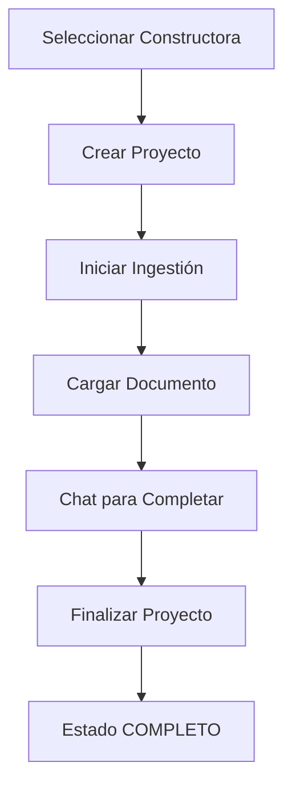
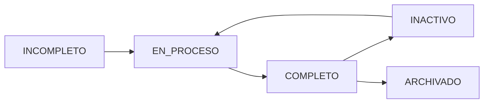
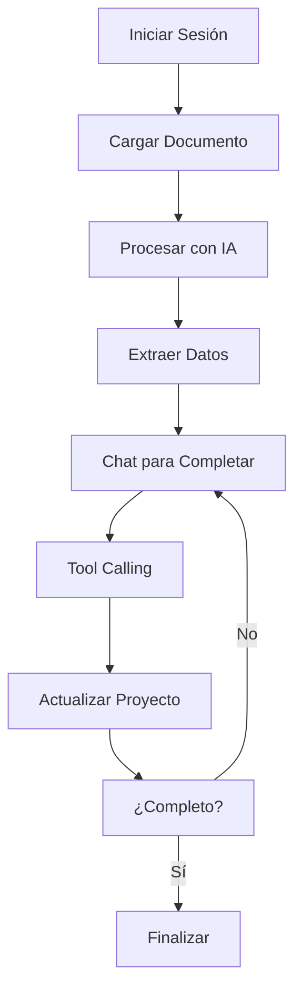

# 🎨 Guía de Desarrollo Frontend - Backend Inmobiliario

## 📋 Contexto del Proyecto

### **🏗️ Arquitectura de Microservicios Implementada**

Hemos desarrollado un backend inmobiliario completo con 3 microservicios interconectados:

#### **1. project-owners-service** (Puerto 8002)
- **Rol:** Gestión de constructoras/empresas inmobiliarias
- **Entidad principal:** `ProjectOwner` (constructora)
- **Clave primaria:** `nit` (NIT de la empresa)
- **Estados:** Activo/Inactivo

#### **2. projects-service** (Puerto 8003)
- **Rol:** Gestión de proyectos inmobiliarios
- **Entidad principal:** `Project` (proyecto)
- **Relación:** Pertenece a una `ProjectOwner`
- **Estados:** INCOMPLETO → EN_PROCESO → COMPLETO → INACTIVO → ARCHIVADO

#### **3. ingestion-agent-service** (Puerto 8004)
- **Rol:** Chat inteligente para completar información de proyectos
- **Entidad principal:** `ConversationSession` (sesión de chat)
- **Funcionalidad:** Procesamiento de documentos + conversación con IA

### **🔗 Comunicación Entre Servicios**

- **Sincronización automática:** Webhooks entre project-owners y projects
- **Tool Calling:** ingestion-agent puede llamar a otros servicios automáticamente
- **Base de datos:** Cada servicio tiene su propia BD SQLite (desarrollo)

---

## 🎯 Especificaciones Técnicas

### **📡 APIs Disponibles**

#### **project-owners-service** (http://localhost:8002)

```javascript
// Endpoints principales
GET    /project-owners                    // Listar constructoras
POST   /project-owners                    // Crear constructora
GET    /project-owners/nit/{nit}         // Obtener por NIT
PUT    /project-owners/nit/{nit}         // Actualizar
DELETE /project-owners/nit/{nit}         // Eliminar (soft delete)
GET    /health                           // Health check
```

**Modelo de datos:**
```json
{
  "nit": "900123456-7",
  "name": "Constructora Norte S.A.S",
  "email": "contacto@constructoranorte.com",
  "phone": "+57 300 123 4567",
  "address": "Calle 123 #45-67",
  "city": "Bogotá",
  "department": "Cundinamarca",
  "country": "Colombia",
  "website": "https://constructoranorte.com",
  "contact_person": "Juan Pérez",
  "contact_phone": "+57 300 987 6543",
  "contact_email": "juan.perez@constructoranorte.com",
  "is_active": true,
  "is_verified": true,
  "created_at": "2024-01-15T10:30:00Z",
  "updated_at": "2024-01-15T10:30:00Z"
}
```

#### **projects-service** (http://localhost:8003)

```javascript
// Endpoints principales
GET    /projects                         // Listar proyectos
POST   /projects                         // Crear proyecto
GET    /projects/{id}                    // Obtener proyecto
PUT    /projects/{id}                    // Actualizar
PATCH  /projects/{id}/state              // Cambiar estado
DELETE /projects/{id}                    // Eliminar
GET    /health                           // Health check
```

**Modelo de datos:**
```json
{
  "id": 1,
  "name": "Torres del Norte",
  "description": "Proyecto de apartamentos en Bogotá",
  "project_owner_nit": "900123456-7",
  "location": {
    "address": "Calle 123 #45-67",
    "city": "Bogotá",
    "department": "Cundinamarca",
    "country": "Colombia",
    "coordinates": {
      "lat": 4.710989,
      "lng": -74.072092
    }
  },
  "price_info": {
    "currency": "COP",
    "min_price": 280000000,
    "max_price": 450000000,
    "price_per_m2": 3500000
  },
  "unit_info": {
    "total_units": 50,
    "available_units": 45,
    "unit_types": [
      {
        "type": "2 habitaciones",
        "count": 30,
        "area_range": "65-75 m²",
        "price_range": "280M-350M"
      },
      {
        "type": "3 habitaciones",
        "count": 20,
        "area_range": "85-95 m²",
        "price_range": "380M-450M"
      }
    ]
  },
  "amenities": [
    "Piscina",
    "Gimnasio",
    "Parqueadero",
    "Zona BBQ",
    "Salón comunal"
  ],
  "financial_info": {
    "financing_available": true,
    "financing_percentage": 70,
    "down_payment_percentage": 30,
    "banks": ["Banco de Bogotá", "Bancolombia"]
  },
  "delivery_info": {
    "estimated_delivery": "2025-12-31",
    "construction_progress": 60,
    "construction_start": "2024-01-15"
  },
  "status": "EN_PROCESO",
  "completion_percentage": 75,
  "created_at": "2024-01-15T10:30:00Z",
  "updated_at": "2024-01-15T10:30:00Z"
}
```

#### **ingestion-agent-service** (http://localhost:8004)

```javascript
// Endpoints principales
POST   /ingest/start                     // Iniciar sesión
POST   /ingest/message                   // Enviar mensaje
POST   /ingest/upload                    // Subir documento
GET    /ingest/status/{session_id}       // Estado de sesión
POST   /ingest/generate-description      // Generar descripción
GET    /ingest/supported-formats         // Formatos soportados
GET    /health                           // Health check
```

**Modelo de sesión:**
```json
{
  "session_id": "b2e1de68-6bd5-4554-9b99-48ec9420636a",
  "status": "active",
  "completion_percentage": 75,
  "current_step": "data_completion",
  "project_data": {
    "name": "Torres del Norte",
    "location": "Bogotá, Colombia",
    "units": "50 apartamentos"
  },
  "missing_fields": ["contact_info", "media_info"]
}
```

---

## 🎨 Especificaciones de Diseño

### **🎯 Patrones de Diseño**

#### **1. Diseño Responsivo**
- **Mobile-first approach**
- **Breakpoints:** 320px, 768px, 1024px, 1440px
- **Componentes adaptables**

#### **2. Estados Visuales**
- **Loading states** para todas las operaciones
- **Error states** con mensajes claros
- **Success states** con confirmaciones
- **Empty states** para listas vacías

#### **3. Navegación**
- **Breadcrumbs** para navegación jerárquica
- **Sidebar** para navegación principal
- **Tabs** para secciones complejas
- **Modal dialogs** para acciones críticas

#### **4. Formularios**
- **Validación en tiempo real**
- **Auto-save** para formularios largos
- **Progreso visual** para formularios complejos
- **Dependencias** entre campos

### **🎨 Paleta de Colores**

```css
/* Estados del proyecto */
.incompleto { color: #dc3545; }    /* Rojo */
.en-proceso { color: #ffc107; }     /* Amarillo */
.completo { color: #28a745; }       /* Verde */
.inactivo { color: #6c757d; }       /* Gris */
.archivado { color: #495057; }      /* Gris oscuro */

/* Estados generales */
.success { color: #28a745; }
.warning { color: #ffc107; }
.error { color: #dc3545; }
.info { color: #17a2b8; }
```

### **📱 Componentes Reutilizables**

#### **1. ProjectCard**
```jsx
<ProjectCard 
  project={project}
  onStatusChange={handleStatusChange}
  onEdit={handleEdit}
  showProgress={true}
  showActions={true}
/>
```

#### **2. ChatInterface**
```jsx
<ChatInterface 
  sessionId={sessionId}
  onMessage={handleMessage}
  onUpload={handleUpload}
  supportedFormats={['.pdf', '.docx', '.xlsx']}
  showProgress={true}
  showToolCalls={false} // Oculto para el usuario
/>
```

#### **3. ProjectForm**
```jsx
<ProjectForm 
  project={project}
  constructors={constructors}
  onSubmit={handleSubmit}
  onValidate={handleValidate}
  autoSave={true}
  showProgress={true}
/>
```

#### **4. ConstructorSelector**
```jsx
<ConstructorSelector 
  selectedNit={selectedNit}
  onSelect={handleConstructorSelect}
  showCreate={true}
  showSearch={true}
/>
```

---

## 🔄 Flujos Principales

### **🔄 Flujo 1: Crear Proyecto Completo**



**Pasos detallados:**
1. **Seleccionar constructora** desde project-owners-service
2. **Crear proyecto** en projects-service con datos básicos
3. **Iniciar sesión** de ingestión en ingestion-agent-service
4. **Cargar documento** (PDF/DOCX/Excel) con drag & drop
5. **Chat conversacional** para completar información faltante
6. **Tool calling automático** (transparente para usuario)
7. **Finalizar proyecto** con estado COMPLETO

### **🔄 Flujo 2: Gestión de Estados**



**Estados y acciones:**
- **INCOMPLETO** (rojo): Solo información básica
  - Acciones: Editar, Iniciar ingestión
- **EN_PROCESO** (amarillo): Completando datos
  - Acciones: Continuar chat, Editar, Pausar
- **COMPLETO** (verde): Listo para publicación
  - Acciones: Publicar, Editar, Archivar
- **INACTIVO** (gris): Pausado
  - Acciones: Reactivar, Archivar
- **ARCHIVADO** (gris oscuro): Finalizado
  - Acciones: Solo consulta

### **🔄 Flujo 3: Chat Inteligente**



**Características del chat:**
- **Interface tipo WhatsApp/Telegram**
- **Drag & drop** para archivos
- **Progreso visual** de procesamiento
- **Tool calling automático** (oculto)
- **Estados de sesión** en tiempo real

---

## 🔧 Configuración Técnica

### **📡 Configuración de APIs**

```javascript
const API_CONFIG = {
  PROJECT_OWNERS: 'http://localhost:8002',
  PROJECTS: 'http://localhost:8003',
  INGESTION_AGENT: 'http://localhost:8004'
};

// Interceptores para manejo de errores
axios.interceptors.response.use(
  response => response,
  error => {
    if (error.code === 'NETWORK_ERROR') {
      showOfflineNotification();
    }
    return Promise.reject(error);
  }
);
```

### **📊 Gestión de Estado**

```javascript
// Ejemplo con Redux Toolkit o Zustand
const projectSlice = createSlice({
  name: 'projects',
  initialState: {
    projects: [],
    loading: false,
    error: null,
    filters: {
      status: 'all',
      constructor: 'all',
      dateRange: null
    }
  },
  reducers: {
    setProjects: (state, action) => {
      state.projects = action.payload;
    },
    updateProjectStatus: (state, action) => {
      const { id, status } = action.payload;
      const project = state.projects.find(p => p.id === id);
      if (project) {
        project.status = status;
      }
    }
  }
});
```

### **🔍 Manejo de Errores**

```javascript
// Patrón de manejo de errores
async function apiCall(endpoint, options = {}) {
  try {
    const response = await fetch(endpoint, {
      headers: {
        'Content-Type': 'application/json',
        ...options.headers
      },
      ...options
    });
    
    if (!response.ok) {
      throw new Error(`HTTP ${response.status}: ${response.statusText}`);
    }
    
    return await response.json();
  } catch (error) {
    showErrorNotification(error.message);
    logError(error);
    throw error;
  }
}
```

---

## 🎯 Componentes Específicos

### **📊 Dashboard Principal**

```jsx
<Dashboard>
  <StatsCards>
    <StatCard title="Proyectos Totales" value={totalProjects} />
    <StatCard title="En Proceso" value={inProgressProjects} />
    <StatCard title="Completados" value={completedProjects} />
    <StatCard title="Constructoras" value={totalConstructors} />
  </StatsCards>
  
  <ProjectStatusChart data={statusData} />
  <RecentProjectsList projects={recentProjects} />
</Dashboard>
```

### **📋 Lista de Proyectos**

```jsx
<ProjectList>
  <ProjectFilters 
    status={statusFilter}
    constructor={constructorFilter}
    dateRange={dateRangeFilter}
    onFilterChange={handleFilterChange}
  />
  
  <ProjectGrid>
    {projects.map(project => (
      <ProjectCard 
        key={project.id}
        project={project}
        onStatusChange={handleStatusChange}
        onEdit={handleEdit}
        showProgress={true}
      />
    ))}
  </ProjectGrid>
  
  <Pagination 
    current={currentPage}
    total={totalPages}
    onChange={handlePageChange}
  />
</ProjectList>
```

### **💬 Chat Interface**

```jsx
<ChatInterface>
  <ChatHeader>
    <SessionInfo session={session} />
    <UploadButton 
      onUpload={handleFileUpload}
      supportedFormats={['.pdf', '.docx', '.xlsx']}
    />
  </ChatHeader>
  
  <ChatMessages>
    {messages.map(message => (
      <ChatMessage 
        key={message.id}
        message={message}
        isUser={message.role === 'user'}
      />
    ))}
  </ChatMessages>
  
  <ChatInput 
    onSend={handleSendMessage}
    placeholder="Escribe tu mensaje..."
    disabled={session.status !== 'active'}
  />
  
  <ChatProgress 
    completion={session.completion_percentage}
    missingFields={session.missing_fields}
  />
</ChatInterface>
```

---

## 🎨 Consideraciones de UX

### **📱 Responsive Design**

```css
/* Mobile First */
.container {
  padding: 1rem;
  max-width: 100%;
}

/* Tablet */
@media (min-width: 768px) {
  .container {
    padding: 2rem;
    max-width: 750px;
  }
}

/* Desktop */
@media (min-width: 1024px) {
  .container {
    padding: 3rem;
    max-width: 1200px;
  }
}
```

### **⚡ Performance**

```javascript
// Lazy loading para listas largas
const ProjectList = lazy(() => import('./ProjectList'));

// Virtual scrolling para grandes datasets
import { FixedSizeList as List } from 'react-window';

// Optimistic updates
const handleStatusChange = async (projectId, newStatus) => {
  // Actualizar UI inmediatamente
  updateProjectStatus(projectId, newStatus);
  
  try {
    // Hacer llamada a API
    await apiCall(`/projects/${projectId}/state`, {
      method: 'PATCH',
      body: JSON.stringify({ status: newStatus })
    });
  } catch (error) {
    // Revertir cambio si falla
    updateProjectStatus(projectId, oldStatus);
    showErrorNotification('Error al cambiar estado');
  }
};
```

### **♿ Accesibilidad**

```jsx
// Ejemplo de componente accesible
<button
  aria-label="Cambiar estado del proyecto"
  aria-describedby="status-description"
  onClick={handleStatusChange}
  className="status-button"
>
  <span id="status-description">
    Estado actual: {project.status}
  </span>
  Cambiar Estado
</button>
```

---

## 🚀 Criterios de Éxito

### **✅ Funcionalidad Completa**
- [ ] CRUD completo para constructoras
- [ ] CRUD completo para proyectos
- [ ] Chat inteligente funcional
- [ ] Carga y procesamiento de documentos
- [ ] Gestión de estados del proyecto

### **✅ Integración Fluida**
- [ ] Comunicación entre servicios
- [ ] Sincronización automática
- [ ] Tool calling transparente
- [ ] Manejo de errores de red

### **✅ UX Intuitiva**
- [ ] Navegación clara y lógica
- [ ] Feedback inmediato para todas las acciones
- [ ] Estados visuales claros
- [ ] Formularios con validación en tiempo real

### **✅ Responsive Design**
- [ ] Funciona en móvil, tablet y desktop
- [ ] Componentes adaptables
- [ ] Touch-friendly en móvil
- [ ] Keyboard navigation completa

### **✅ Performance**
- [ ] Carga rápida (< 3 segundos)
- [ ] Lazy loading implementado
- [ ] Caching de datos frecuentes
- [ ] Optimistic updates

### **✅ Accesibilidad**
- [ ] ARIA labels completos
- [ ] Keyboard navigation
- [ ] Color contrast adecuado
- [ ] Screen reader compatible

---

## 📚 Recursos Adicionales

### **🔗 Documentación de APIs**
- **Swagger UI:** http://localhost:8002/docs (project-owners)
- **Swagger UI:** http://localhost:8003/docs (projects)
- **Swagger UI:** http://localhost:8004/docs (ingestion-agent)

### **📖 Documentación del Proyecto**
- `FLUJO_COMPLETO.md` - Flujo completo demostrado
- `MANEJO_TOKENS.md` - Manejo de tokens y modos
- `README.md` - Documentación general

### **🧪 Testing**
- **Tests básicos:** `test_service.py` en cada servicio
- **Flujo completo:** `test_flow.py` para ingestion-agent
- **Modo simulado:** `test_mode.py` para desarrollo

---

**🎯 Esta guía proporciona toda la información necesaria para desarrollar interfaces de usuario efectivas y bien integradas con el backend inmobiliario implementado.** 