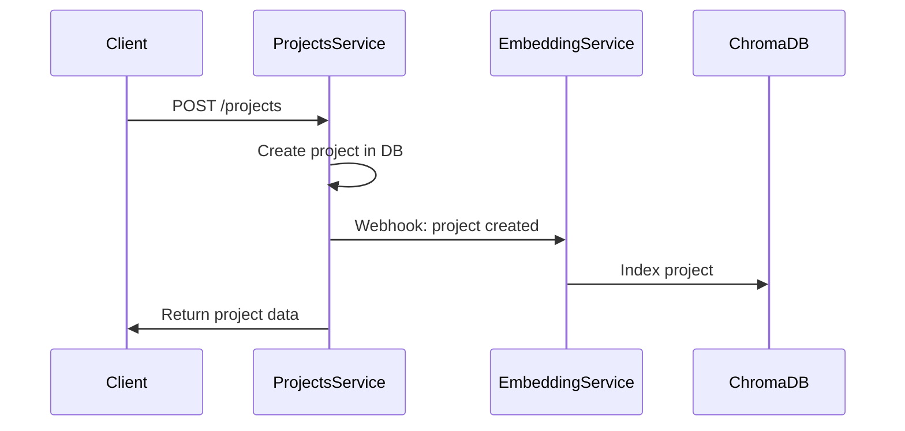
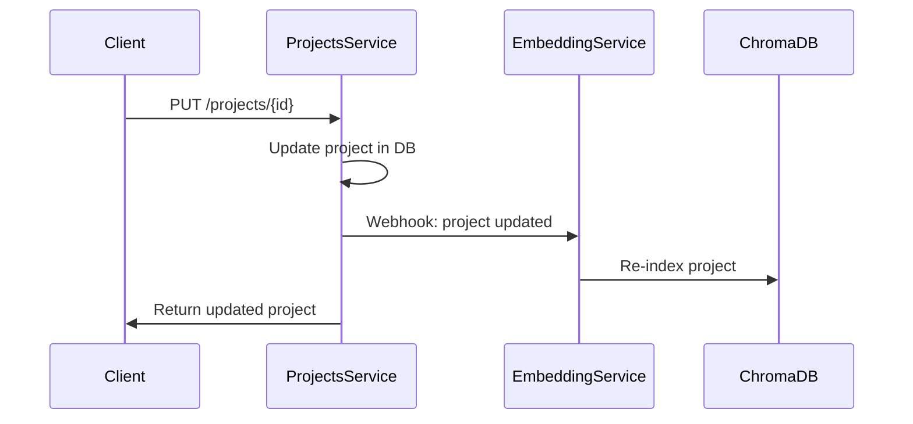
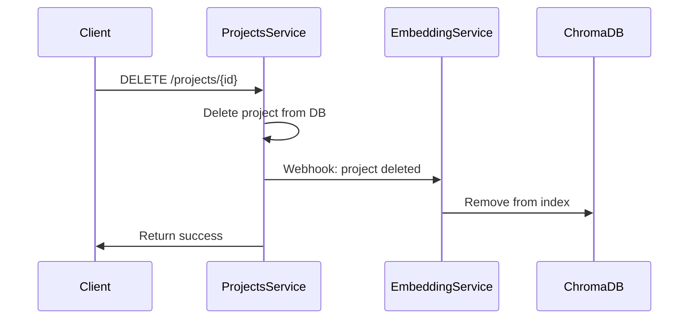

# 🔗 Integración del Embedding Service

## 📋 **Resumen de Integración**

El **embedding-service** se integra con los otros servicios de la plataforma a través de **webhooks** y **APIs REST**, proporcionando búsqueda vectorial semántica para proyectos inmobiliarios.

## 🏗️ **Arquitectura de Integración**

```
┌─────────────────┐    Webhooks    ┌─────────────────┐
│  Projects       │ ──────────────► │  Embedding      │
│  Service        │                 │  Service        │
│  (8003)         │                 │  (8005)         │
└─────────────────┘                 └─────────────────┘
         │                                   │
         │                                   │
         ▼                                   ▼
┌─────────────────┐                 ┌─────────────────┐
│  Project        │                 │  ChromaDB       │
│  Owners         │                 │  Vector DB      │
│  Service        │                 │                 │
│  (8002)         │                 └─────────────────┘
└─────────────────┘
```

## 🔄 **Flujo de Integración**

### 1. **Creación de Proyecto**


### 2. **Actualización de Proyecto**


### 3. **Eliminación de Proyecto**


## 📡 **Webhooks Implementados**

### **Projects Service → Embedding Service**

#### **Crear Proyecto**
```http
POST /webhook/project-sync
Content-Type: application/json

{
  "project_id": 1,
  "action": "create",
  "data": {
    "id": 1,
    "name": "Torre Residencial",
    "description": "Apartamentos de lujo en Bogotá",
    "location": "Chapinero",
    "city": "Bogotá",
    "state": "Cundinamarca",
    "property_type": "Apartamento",
    "construction_company_nit": "12345678-9"
  }
}
```

#### **Actualizar Proyecto**
```http
POST /webhook/project-sync
Content-Type: application/json

{
  "project_id": 1,
  "action": "update",
  "data": {
    "id": 1,
    "name": "Torre Residencial Premium",
    "description": "Apartamentos de lujo premium en Bogotá",
    "amenities": ["Piscina", "Gimnasio", "Spa"]
  }
}
```

#### **Eliminar Proyecto**
```http
POST /webhook/project-sync
Content-Type: application/json

{
  "project_id": 1,
  "action": "delete",
  "data": null
}
```

## 🔍 **Búsqueda Vectorial**

### **Búsqueda Semántica**
```http
POST /search
Content-Type: application/json

{
  "query": "apartamentos en bogota con piscina",
  "collection": "real_estate_projects",
  "max_results": 10,
  "similarity_threshold": 0.7
}
```

### **Respuesta de Búsqueda**
```json
{
  "results": [
    {
      "id": "project_1",
      "score": 0.85,
      "metadata": {
        "name": "Torre Residencial Los Andes",
        "location": "Chapinero",
        "property_type": "Apartamento",
        "amenities": "[\"Piscina\", \"Gimnasio\"]"
      },
      "document": "torre residencial los andes apartamentos..."
    }
  ],
  "total_results": 1,
  "query": "apartamentos en bogota con piscina",
  "collection": "real_estate_projects"
}
```

## 🔧 **Configuración de Integración**

### **Variables de Entorno**

#### **Projects Service**
```bash
# services/projects-service/.env
EMBEDDING_SERVICE_URL=http://localhost:8005
PROJECT_OWNERS_SERVICE_URL=http://localhost:8002
```

#### **Embedding Service**
```bash
# services/embedding-service/.env
PROJECTS_SERVICE_URL=http://localhost:8003
PROJECT_OWNERS_SERVICE_URL=http://localhost:8002
```

## 🧪 **Testing de Integración**

### **Script de Prueba**
```bash
# Ejecutar test de integración
cd services/embedding-service
python integration_test.py
```

### **Pasos del Test**
1. **Crear proyecto** en projects-service
2. **Verificar indexación** en embedding-service
3. **Actualizar proyecto** y verificar re-indexación
4. **Buscar proyectos** usando búsqueda vectorial
5. **Verificar sincronización** manual

## 📊 **Monitoreo y Logs**

### **Logs de Webhooks**
```bash
# Projects Service logs
tail -f logs/projects_service.log | grep webhook

# Embedding Service logs
tail -f logs/embedding_service.log | grep webhook
```

### **Métricas de Integración**
- **Proyectos indexados**: `/collections/real_estate_projects`
- **Health checks**: `/health` en ambos servicios
- **Sincronización**: `/sync/projects`

## 🚀 **Despliegue**

### **Orden de Inicio**
1. **Project Owners Service** (8002)
2. **Projects Service** (8003)
3. **Embedding Service** (8005)

### **Verificación de Integración**
```bash
# Verificar que todos los servicios estén corriendo
curl http://localhost:8002/health
curl http://localhost:8003/health
curl http://localhost:8005/health
```

## 🔒 **Seguridad**

### **Webhook Authentication** (Futuro)
```bash
# Agregar autenticación a webhooks
WEBHOOK_SECRET=your_secret_key
```

### **Rate Limiting** (Futuro)
```bash
# Limitar requests por minuto
RATE_LIMIT=100
```

## 📈 **Escalabilidad**

### **Horizontal Scaling**
- **ChromaDB**: Múltiples instancias
- **Embedding Service**: Load balancer
- **Projects Service**: Múltiples réplicas

### **Caching**
- **Embeddings**: Redis cache
- **Search Results**: CDN cache

## 🐛 **Troubleshooting**

### **Problemas Comunes**

#### **Webhook no llega**
```bash
# Verificar conectividad
curl -X POST http://localhost:8005/webhook/project-sync \
  -H "Content-Type: application/json" \
  -d '{"project_id": 1, "action": "test"}'
```

#### **Búsqueda no encuentra resultados**
```bash
# Verificar colección
curl http://localhost:8005/collections/real_estate_projects

# Sincronizar manualmente
curl -X POST http://localhost:8005/sync/projects
```

#### **Error de indexación**
```bash
# Verificar logs
tail -f logs/embedding_service.log

# Reindexar proyecto específico
curl -X POST http://localhost:8005/projects/index \
  -H "Content-Type: application/json" \
  -d '{"id": 1, "name": "Test Project", ...}'
```

## 📚 **Referencias**

- [ChromaDB Documentation](https://docs.trychroma.com/)
- [Sentence Transformers](https://www.sbert.net/)
- [FastAPI Webhooks](https://fastapi.tiangolo.com/tutorial/background-tasks/)
- [Vector Search Best Practices](https://www.pinecone.io/learn/vector-search/) 